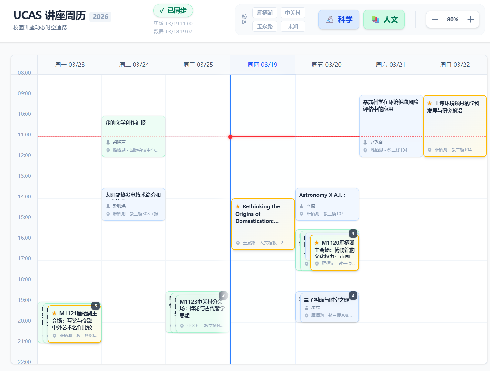

# UCAS Lectures (国科大讲座周历)

本项目包含中国科学院大学（UCAS）讲座信息的公开数据源，以及一个用于直观展示讲座安排的现代化 Web 周历应用。

🌐 **在线访问**: [https://yi-jun-wu.github.io/UCAS-Lectures/](https://yi-jun-wu.github.io/UCAS-Lectures/)


## 📖 项目简介

本仓库具有双重作用：
1. **公开数据源**：结构化存储国科大的最新讲座信息（分为科学讲座与人文讲座），以 JSON 格式托管，可供其他开发者或应用直接调用。
2. **前端 Web 应用**：托管网页端周历的源代码（基于 React + Vite + Tailwind CSS）。该应用通过 GitHub Actions 自动构建，并部署至 GitHub Pages。


- **网页预览**： [](https://yi-jun-wu.github.io/UCAS-Lectures/)

## ✨ 核心特性

前端应用专为高密度的讲座信息展示而设计，具备以下特性：

* **直观的周历视图**：采用物理位置固定的周一至周日布局，配合环绕式时间窗口，专注于展示当前及未来 7 天的讲座动态。
* **智能排版引擎**：针对同一时段的高频重叠讲座，内置二维防遮挡排版算法，确保卡片阶梯式错开，配合拥挤度徽章，保证信息的可读性与交互的准确性。
* **多维交叉筛选**：支持按讲座类别（科学/人文）以及校区（雁栖湖/中关村/玉泉路/未知）进行无缝交叉筛选。
* **离线优先设计 (Offline-First)**：优先读取本地缓存，实现页面的秒级渲染；支持在弱网或断网环境下查看历史数据，并提供清晰的网络同步状态指示。
* **个性化管理**：支持对特定讲座进行“星标”收藏，星标讲座将在视觉层级中置顶，且配置保留在用户本地。

## ⚙️ 架构与数据流

本系统的数据抓取与前端展示完全解耦，主要流程如下：

1. **自动抓取**：讲座数据的抓取逻辑独立部署于 [Yi-Jun-Wu/Scheduled-Tasks-Public](https://github.com/Yi-Jun-Wu/Scheduled-Tasks-Public) 仓库。该仓库的 `check-lectures` 工作流会定期运行。
2. **数据同步**：抓取到的最新数据会被格式化为 JSON 文件，并自动推送至本仓库 `main` 分支的 `science/` 和 `humanity/` 目录下。
3. **前端渲染**：Web 应用在用户访问时，直接从本仓库的 Raw 链接静默拉取最新的 JSON 数据进行渲染更新。

## 🔗 数据 API 接口

如果你希望在自己的项目中使用这些讲座数据，可以直接请求以下公开的 GitHub Raw 链接（数据格式为标准的 JSON）：

* **科学讲座**: `https://raw.githubusercontent.com/Yi-Jun-Wu/UCAS-Lectures/refs/heads/main/science/latest.json`
* **人文讲座**: `https://raw.githubusercontent.com/Yi-Jun-Wu/UCAS-Lectures/refs/heads/main/humanity/latest.json`

## 💻 本地开发

如果你希望在本地运行或二次开发此 Web 应用，请按照以下步骤操作：

### 环境要求
* Node.js (建议 v18+)
* npm 或 pnpm

### 启动步骤

1. 克隆本仓库：
   ```bash
   git clone [https://github.com/Yi-Jun-Wu/UCAS-Lectures.git](https://github.com/Yi-Jun-Wu/UCAS-Lectures.git)
   cd UCAS-Lectures
   ```

2.  安装依赖：

    ```bash
    npm install
    ```

3.  启动本地开发服务器：

    ```bash
    npm run dev
    ```

4.  构建生产版本：

    ```bash
    npm run build
    ```

## 📄 开源协议

本网站源码基于 [MIT License](./license) 开源。允许任何人在遵守协议的前提下进行使用、修改和分发。

